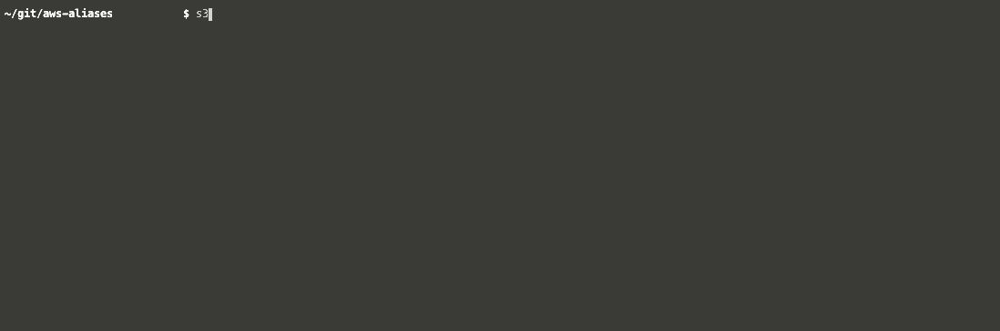

# AWS Aliases

Type an AWS service name in your terminal and the AWS console appears in your browser for that service.



## Installation

```bash
make install
```

## Usage

```bash
$ ec2
$ s3 && sqs
```

 You should see the AWS console for these services appear in browser tabs.
